# SQL Cheat Sheet - Quick Reference Guide

## About This Cheat Sheet

This cheat sheet provides a quick reference for SQL fundamentals, organized by the logical execution order of SQL queries. Each module focuses on a specific SQL clause or concept, providing essential syntax, rules, and tips.

## SQL Query Execution Order

**The most important concept in SQL** - Understanding this order explains alias scope, WHERE vs. HAVING usage, and overall query behavior:

```mermaid
---
config:
  theme: base
  themeVariables:
    primaryColor: '#2d3748'
    primaryTextColor: '#ffffff'
    primaryBorderColor: '#1a202c'
    lineColor: '#4a5568'
    secondaryColor: '#f7fafc'
    background: '#ffffff'
    fontSize: '16px'
---
flowchart LR
    A["1. FROM & JOIN<br/>Define sources"] 
    B["2. WHERE<br/>Filter rows"]
    C["3. GROUP BY<br/>Group rows"]
    D["4. HAVING<br/>Filter groups"]
    E["5. SELECT<br/>Choose columns"]
    F["6. DISTINCT<br/>Remove dupes"]
    G["7. ORDER BY<br/>Sort results"]
    H["8. LIMIT<br/>Restrict rows"]
    
    A --> B --> C --> D --> E --> F --> G --> H
    
    classDef default fill:#f7fafc,stroke:#2d3748,stroke-width:2px,color:#2d3748
```

<div align="center">



</div>

> **💡 Key Point**: This execution order is logical, not necessarily the physical order. Understanding it helps you write correct, efficient SQL.

## How to Use This Cheat Sheet

Each module covers one major SQL component:

- **Module 1**: FROM Clause and JOINs
- **Module 2**: WHERE Clause and Filtering  
- **Module 3**: GROUP BY and Aggregate Functions
- **Module 4**: HAVING Clause
- **Module 5**: SELECT Clause and Expressions
- **Module 6**: ORDER BY Clause
- **Module 7**: LIMIT and Result Set Control

## Quick Syntax Reference

```sql
-- Complete query structure
SELECT [DISTINCT] column_list
FROM table_name [alias]
[JOIN other_table ON condition]
[WHERE condition]
[GROUP BY column_list]
[HAVING condition]
[ORDER BY column_list [ASC|DESC]]
[LIMIT number [OFFSET number]]
```

## Key SQL Principles

1. **No guaranteed order without ORDER BY** - Results are arbitrary without explicit sorting
2. **NULL requires special handling** - Use `IS NULL`/`IS NOT NULL`, not `= NULL`
3. **Performance matters** - Write sargable conditions, index join columns
4. **DBMS variations exist** - Test syntax on your target database system
5. **Aliases have scope** - Can't use SELECT aliases in WHERE/GROUP BY/HAVING

Let's dive into each module for detailed syntax and best practices! 