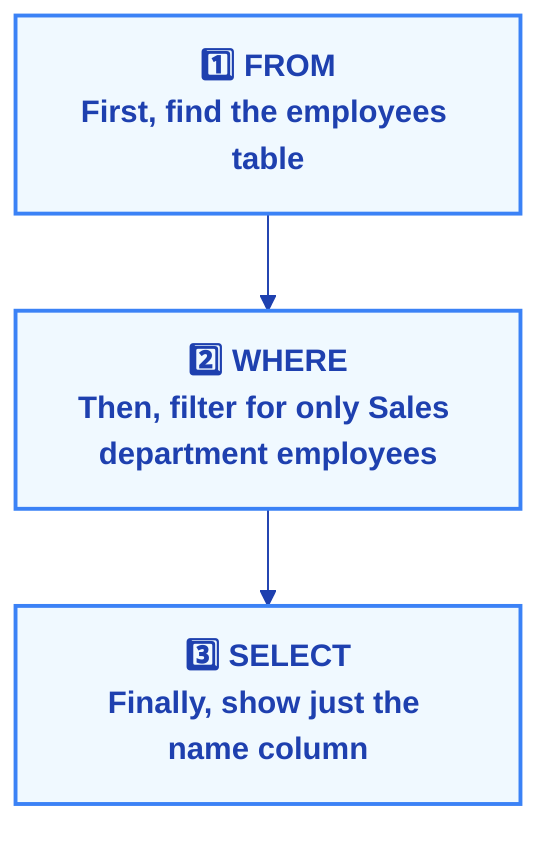
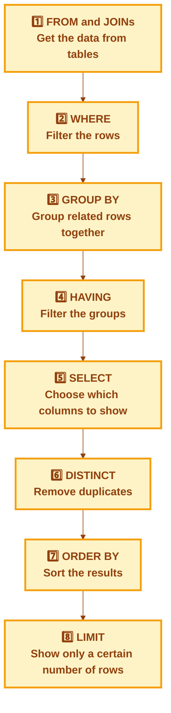

# Introduction: Getting Started with SQL Basics

## Why This Guide Will Help You Learn SQL

This guide is designed to help beginners learn SQL step by step. SQL (Structured Query Language) is used to talk to databases and get information from them. Think of a database like a digital filing cabinet with many organized folders (tables) containing information.

Instead of just memorizing SQL commands, this guide will help you understand WHY we write queries a certain way. This understanding is much more valuable than just copying code examples. When you understand the "why," you can solve new problems and write better queries.

## Who This Guide is For

This guide is perfect for:
- Complete beginners who have never written SQL before
- Students learning databases for the first time
- People starting careers in data analysis or business intelligence
- Anyone who wants to understand how to get information from databases

No prior experience is needed! We'll start with the very basics and build up your knowledge gradually.

## What You'll Learn in Each Chapter

Each chapter focuses on one important SQL concept. We'll explain:
- **What it does** - The purpose of each SQL command
- **How it works** - When and how the database processes it
- **Simple examples** - Easy-to-understand practice scenarios
- **Common mistakes** - What beginners often get wrong and how to avoid these errors

## Understanding How SQL Thinks (The Secret to Success)

Here's something important that many beginners don't know: SQL doesn't process your query in the order you write it!

When you write a query like this:
```sql
SELECT name 
FROM employees 
WHERE department = 'Sales'
```

You might think the database reads it top to bottom (SELECT, then FROM, then WHERE). But actually, the database processes it in this order:



Think of it like getting dressed: even though you might say "I'll wear my blue shirt with jeans," you actually put on the jeans first, then the shirt. SQL works similarly!

## The Order SQL Actually Processes Your Query

Here's the order the database follows (don't worry if this seems confusing now - we'll explain each step):



Understanding this order will help you avoid many common mistakes and write better queries. We'll refer back to this order throughout the guide to help everything make sense.

## Ready to Start?

Don't worry if some of these concepts seem unclear right now. We'll take it slow and explain everything with simple examples. By the end of this guide, you'll be comfortable writing SQL queries and understanding how they work! 