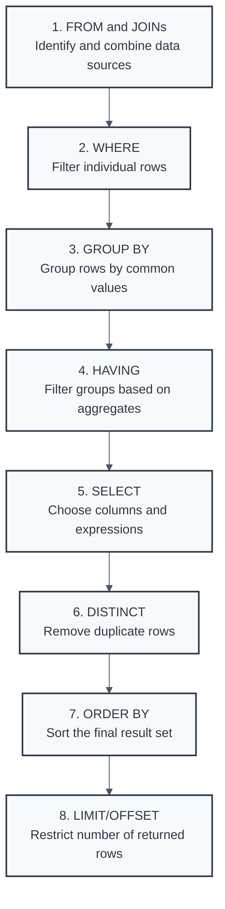

# Introduction: Getting Started with SQL Concepts

## Why This Guide is Your Go-To for SQL Interviews

This guide serves as a comprehensive resource for individuals preparing for SQL-related technical interviews. Its core aim is to foster a deep understanding of essential SQL clauses, their operational mechanics within database engines, and common scenarios encountered during interviews. The focus extends beyond mere syntax; it encompasses conceptual clarity, practical application, and an awareness of common pitfalls and edge cases pertinent to real-world database interactions.

Interviewers for SQL roles are typically less interested in a candidate's ability to merely recall syntax. Instead, they seek to determine if the candidate understands why a query is structured in a particular way, how it is likely to perform, and what potential issues might arise. Memorizing SQL commands without grasping the underlying principles is insufficient for demonstrating true proficiency. This guide emphasizes building a robust foundational knowledge, enabling candidates to articulate not just the "how" but also the "why" behind their SQL solutions. It delves into how database engines interpret queries and how SQL can be effectively applied, preparing candidates for questions that probe beyond surface-level knowledge.

## Who This Guide is For

The content herein is tailored for a broad audience. This includes aspiring and current data analysts, data scientists, database developers, Business Intelligence (BI) developers, and software engineers whose roles involve SQL utilization. Whether an individual is preparing for an entry-level position or aiming to advance to a mid-level role, this material offers valuable information to solidify their SQL expertise.

## What You'll Find Inside (A Chapter-by-Chapter Peek)

Each chapter of this guide is dedicated to a key SQL clause or concept. For every major clause, the structure includes a detailed explanation of its function ("What it does"), its position and role in the logical query execution order ("Execution"), and a curated set of common interview questions, complete with expert-level answers and explanations. Advanced concepts, performance considerations, and potential edge cases are also explored to provide a well-rounded understanding.

## Why Understanding How SQL Queries Think is a Game-Changer

A fundamental aspect of mastering SQL, and a frequent subject of interview questions, is understanding the logical query processing order. SQL is a declarative language, meaning users specify what data they want, not necessarily how the database should retrieve it. The database engine translates SQL statements into an execution plan, which follows a specific logical sequence of operations. This sequence often differs from the order in which clauses are written in a query. For instance, the FROM clause is logically processed before the SELECT clause, even though SELECT appears first in the written query.

Many common SQL errors and misunderstandings arise from a lack of awareness of this logical execution order. For example, knowing that the WHERE clause is processed before the SELECT clause explains why column aliases defined in the SELECT list cannot be directly referenced in the WHERE clause. Users might intuitively expect processing to follow the written order of clauses. When the database engine behaves differently—because it adheres to a distinct logical order—errors can occur, or queries might produce unexpected results. Understanding this logical sequence demystifies such errors; they are not arbitrary but are a consequence of a defined processing pipeline. This understanding is not merely academic; it is crucial for writing correct, efficient queries, debugging issues, and optimizing performance. Interviewers often test this foundational knowledge implicitly. A solid grasp of logical query processing is, therefore, indispensable.

## The Logical Query Processing Order

### Enhanced Interactive Flow Diagram with Sample Code

This interactive diagram shows the complete SQL query execution process with detailed explanations. **Hover over any step** to see detailed information, sample code, and processing details.

  <svg id="sql-flow-svg" width="100%" height="800" viewBox="0 0 1000 800" style="border: 1px solid #e2e8f0; border-radius: 8px; background: #ffffff;">
    <!-- Background gradient definitions -->
    <defs>
      <linearGradient id="phaseGradient1" x1="0%" y1="0%" x2="100%" y2="0%">
        <stop offset="0%" style="stop-color:#f7fafc;stop-opacity:0.3" />
        <stop offset="100%" style="stop-color:#e2e8f0;stop-opacity:0.8" />
      </linearGradient>
      <linearGradient id="phaseGradient2" x1="0%" y1="0%" x2="100%" y2="0%">
        <stop offset="0%" style="stop-color:#edf2f7;stop-opacity:0.3" />
        <stop offset="100%" style="stop-color:#cbd5e0;stop-opacity:0.8" />
      </linearGradient>
      <linearGradient id="phaseGradient3" x1="0%" y1="0%" x2="100%" y2="0%">
        <stop offset="0%" style="stop-color:#e2e8f0;stop-opacity:0.3" />
        <stop offset="100%" style="stop-color:#a0aec0;stop-opacity:0.8" />
      </linearGradient>
      
      <!-- Drop shadow filter -->
      <filter id="dropShadow" x="-20%" y="-20%" width="140%" height="140%">
        <feDropShadow dx="2" dy="2" stdDeviation="3" flood-color="#000000" flood-opacity="0.2"/>
      </filter>
      
      <!-- Hover glow filter -->
      <filter id="hoverGlow" x="-50%" y="-50%" width="200%" height="200%">
        <feGaussianBlur stdDeviation="4" result="coloredBlur"/>
        <feMerge> 
          <feMergeNode in="coloredBlur"/>
          <feMergeNode in="SourceGraphic"/>
        </feMerge>
      </filter>
      
      <!-- Arrow marker -->
      <marker id="arrowhead" markerWidth="10" markerHeight="7" 
              refX="9" refY="3.5" orient="auto">
        <polygon points="0 0, 10 3.5, 0 7" fill="#4a5568" />
      </marker>
    </defs>
    
    <!-- Phase backgrounds -->
    <rect x="50" y="150" width="900" height="120" rx="8" fill="url(#phaseGradient1)" stroke="#cbd5e0" stroke-width="1"/>
    <text x="70" y="175" font-family="Arial, sans-serif" font-size="14" font-weight="bold" fill="#4a5568">Phase 1: Data Assembly</text>
    
    <rect x="50" y="300" width="900" height="120" rx="8" fill="url(#phaseGradient2)" stroke="#cbd5e0" stroke-width="1"/>
    <text x="70" y="325" font-family="Arial, sans-serif" font-size="14" font-weight="bold" fill="#4a5568">Phase 2: Grouping & Aggregation</text>
    
    <rect x="50" y="450" width="900" height="200" rx="8" fill="url(#phaseGradient3)" stroke="#cbd5e0" stroke-width="1"/>
    <text x="70" y="475" font-family="Arial, sans-serif" font-size="14" font-weight="bold" fill="#4a5568">Phase 3: Output Formatting</text>
    
    <!-- Starting Query Box -->
    <rect x="200" y="50" width="600" height="80" rx="8" fill="#2d3748" stroke="#1a202c" stroke-width="2" filter="url(#dropShadow)" class="sql-step" data-step="start"/>
    <text x="500" y="75" text-anchor="middle" font-family="monospace" font-size="11" fill="#ffffff" font-weight="bold">Original SQL Query</text>
    <text x="500" y="95" text-anchor="middle" font-family="monospace" font-size="10" fill="#e2e8f0">SELECT dept, COUNT(*), AVG(salary) FROM employees e</text>
    <text x="500" y="110" text-anchor="middle" font-family="monospace" font-size="10" fill="#e2e8f0">JOIN departments d ON e.dept_id = d.id WHERE salary &gt; 50000...</text>
    
    <!-- Phase 1: Data Assembly -->
    <!-- Step 1: FROM & JOINs -->
    <rect x="100" y="190" width="180" height="60" rx="6" fill="#ffffff" stroke="#2d3748" stroke-width="2" filter="url(#dropShadow)" class="sql-step" data-step="from"/>
    <text x="190" y="210" text-anchor="middle" font-family="Arial, sans-serif" font-size="12" font-weight="bold" fill="#2d3748">1. FROM &amp; JOINs</text>
    <text x="190" y="225" text-anchor="middle" font-family="Arial, sans-serif" font-size="10" fill="#4a5568">Identify data sources</text>
    <text x="190" y="240" text-anchor="middle" font-family="Arial, sans-serif" font-size="10" fill="#4a5568">and combine tables</text>
    
    <!-- Step 2: WHERE -->
    <rect x="320" y="190" width="180" height="60" rx="6" fill="#ffffff" stroke="#2d3748" stroke-width="2" filter="url(#dropShadow)" class="sql-step" data-step="where"/>
    <text x="410" y="210" text-anchor="middle" font-family="Arial, sans-serif" font-size="12" font-weight="bold" fill="#2d3748">2. WHERE</text>
    <text x="410" y="225" text-anchor="middle" font-family="Arial, sans-serif" font-size="10" fill="#4a5568">Filter individual rows</text>
    <text x="410" y="240" text-anchor="middle" font-family="Arial, sans-serif" font-size="10" fill="#4a5568">before grouping</text>
    
    <!-- Phase 2: Grouping & Aggregation -->
    <!-- Step 3: GROUP BY -->
    <rect x="100" y="340" width="180" height="60" rx="6" fill="#ffffff" stroke="#2d3748" stroke-width="2" filter="url(#dropShadow)" class="sql-step" data-step="groupby"/>
    <text x="190" y="360" text-anchor="middle" font-family="Arial, sans-serif" font-size="12" font-weight="bold" fill="#2d3748">3. GROUP BY</text>
    <text x="190" y="375" text-anchor="middle" font-family="Arial, sans-serif" font-size="10" fill="#4a5568">Group rows by</text>
    <text x="190" y="390" text-anchor="middle" font-family="Arial, sans-serif" font-size="10" fill="#4a5568">common values</text>
    
    <!-- Step 4: HAVING -->
    <rect x="320" y="340" width="180" height="60" rx="6" fill="#ffffff" stroke="#2d3748" stroke-width="2" filter="url(#dropShadow)" class="sql-step" data-step="having"/>
    <text x="410" y="360" text-anchor="middle" font-family="Arial, sans-serif" font-size="12" font-weight="bold" fill="#2d3748">4. HAVING</text>
    <text x="410" y="375" text-anchor="middle" font-family="Arial, sans-serif" font-size="10" fill="#4a5568">Filter groups based</text>
    <text x="410" y="390" text-anchor="middle" font-family="Arial, sans-serif" font-size="10" fill="#4a5568">on aggregates</text>
    
    <!-- Phase 3: Output Formatting -->
    <!-- Step 5: SELECT -->
    <rect x="100" y="490" width="180" height="60" rx="6" fill="#ffffff" stroke="#2d3748" stroke-width="2" filter="url(#dropShadow)" class="sql-step" data-step="select"/>
    <text x="190" y="510" text-anchor="middle" font-family="Arial, sans-serif" font-size="12" font-weight="bold" fill="#2d3748">5. SELECT</text>
    <text x="190" y="525" text-anchor="middle" font-family="Arial, sans-serif" font-size="10" fill="#4a5568">Choose columns</text>
    <text x="190" y="540" text-anchor="middle" font-family="Arial, sans-serif" font-size="10" fill="#4a5568">and expressions</text>
    
    <!-- Step 6: DISTINCT -->
    <rect x="320" y="490" width="180" height="60" rx="6" fill="#ffffff" stroke="#2d3748" stroke-width="2" filter="url(#dropShadow)" class="sql-step" data-step="distinct"/>
    <text x="410" y="510" text-anchor="middle" font-family="Arial, sans-serif" font-size="12" font-weight="bold" fill="#2d3748">6. DISTINCT</text>
    <text x="410" y="525" text-anchor="middle" font-family="Arial, sans-serif" font-size="10" fill="#4a5568">Remove duplicate</text>
    <text x="410" y="540" text-anchor="middle" font-family="Arial, sans-serif" font-size="10" fill="#4a5568">rows (if specified)</text>
    
    <!-- Step 7: ORDER BY -->
    <rect x="540" y="490" width="180" height="60" rx="6" fill="#ffffff" stroke="#2d3748" stroke-width="2" filter="url(#dropShadow)" class="sql-step" data-step="orderby"/>
    <text x="630" y="510" text-anchor="middle" font-family="Arial, sans-serif" font-size="12" font-weight="bold" fill="#2d3748">7. ORDER BY</text>
    <text x="630" y="525" text-anchor="middle" font-family="Arial, sans-serif" font-size="10" fill="#4a5568">Sort the final</text>
    <text x="630" y="540" text-anchor="middle" font-family="Arial, sans-serif" font-size="10" fill="#4a5568">result set</text>
    
    <!-- Step 8: LIMIT -->
    <rect x="760" y="490" width="180" height="60" rx="6" fill="#ffffff" stroke="#2d3748" stroke-width="2" filter="url(#dropShadow)" class="sql-step" data-step="limit"/>
    <text x="850" y="510" text-anchor="middle" font-family="Arial, sans-serif" font-size="12" font-weight="bold" fill="#2d3748">8. LIMIT/OFFSET</text>
    <text x="850" y="525" text-anchor="middle" font-family="Arial, sans-serif" font-size="10" fill="#4a5568">Restrict number of</text>
    <text x="850" y="540" text-anchor="middle" font-family="Arial, sans-serif" font-size="10" fill="#4a5568">returned rows</text>
    
    <!-- Final Result -->
    <rect x="350" y="680" width="300" height="60" rx="8" fill="#2d3748" stroke="#1a202c" stroke-width="2" filter="url(#dropShadow)" class="sql-step" data-step="result"/>
    <text x="500" y="700" text-anchor="middle" font-family="Arial, sans-serif" font-size="12" font-weight="bold" fill="#ffffff">Final Result Set</text>
    <text x="500" y="715" text-anchor="middle" font-family="Arial, sans-serif" font-size="10" fill="#e2e8f0">Top 5 departments with &gt;10 high-salary employees,</text>
    <text x="500" y="730" text-anchor="middle" font-family="Arial, sans-serif" font-size="10" fill="#e2e8f0">sorted by employee count</text>
    
    <!-- Connection arrows -->
    <line x1="500" y1="130" x2="190" y2="190" stroke="#4a5568" stroke-width="2" marker-end="url(#arrowhead)"/>
    <line x1="280" y1="220" x2="320" y2="220" stroke="#4a5568" stroke-width="2" marker-end="url(#arrowhead)"/>
    <line x1="410" y1="250" x2="190" y2="340" stroke="#4a5568" stroke-width="2" marker-end="url(#arrowhead)"/>
    <line x1="280" y1="370" x2="320" y2="370" stroke="#4a5568" stroke-width="2" marker-end="url(#arrowhead)"/>
    <line x1="410" y1="400" x2="190" y2="490" stroke="#4a5568" stroke-width="2" marker-end="url(#arrowhead)"/>
    <line x1="280" y1="520" x2="320" y2="520" stroke="#4a5568" stroke-width="2" marker-end="url(#arrowhead)"/>
    <line x1="500" y1="520" x2="540" y2="520" stroke="#4a5568" stroke-width="2" marker-end="url(#arrowhead)"/>
    <line x1="720" y1="520" x2="760" y2="520" stroke="#4a5568" stroke-width="2" marker-end="url(#arrowhead)"/>
    <line x1="850" y1="550" x2="500" y2="680" stroke="#4a5568" stroke-width="2" marker-end="url(#arrowhead)"/>
  </svg>

<!-- Tooltip -->

  

  

  

  

This guide will continually refer to this execution order to clarify the behavior and constraints of each SQL clause.