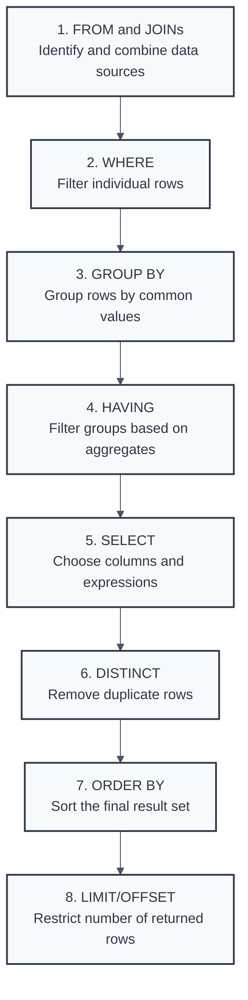

# Introduction: Getting Started with SQL Concepts

## Why This Guide is Your Go-To for SQL Interviews

This guide serves as a comprehensive resource for individuals preparing for SQL-related technical interviews. Its core aim is to foster a deep understanding of essential SQL clauses, their operational mechanics within database engines, and common scenarios encountered during interviews. The focus extends beyond mere syntax; it encompasses conceptual clarity, practical application, and an awareness of common pitfalls and edge cases pertinent to real-world database interactions.

Interviewers for SQL roles are typically less interested in a candidate's ability to merely recall syntax. Instead, they seek to determine if the candidate understands why a query is structured in a particular way, how it is likely to perform, and what potential issues might arise. Memorizing SQL commands without grasping the underlying principles is insufficient for demonstrating true proficiency. This guide emphasizes building a robust foundational knowledge, enabling candidates to articulate not just the "how" but also the "why" behind their SQL solutions. It delves into how database engines interpret queries and how SQL can be effectively applied, preparing candidates for questions that probe beyond surface-level knowledge.

## Who This Guide is For

The content herein is tailored for a broad audience. This includes aspiring and current data analysts, data scientists, database developers, Business Intelligence (BI) developers, and software engineers whose roles involve SQL utilization. Whether an individual is preparing for an entry-level position or aiming to advance to a mid-level role, this material offers valuable information to solidify their SQL expertise.

## What You'll Find Inside (A Chapter-by-Chapter Peek)

Each chapter of this guide is dedicated to a key SQL clause or concept. For every major clause, the structure includes a detailed explanation of its function ("What it does"), its position and role in the logical query execution order ("Execution"), and a curated set of common interview questions, complete with expert-level answers and explanations. Advanced concepts, performance considerations, and potential edge cases are also explored to provide a well-rounded understanding.

## Why Understanding How SQL Queries Think is a Game-Changer

A fundamental aspect of mastering SQL, and a frequent subject of interview questions, is understanding the logical query processing order. SQL is a declarative language, meaning users specify what data they want, not necessarily how the database should retrieve it. The database engine translates SQL statements into an execution plan, which follows a specific logical sequence of operations. This sequence often differs from the order in which clauses are written in a query. For instance, the FROM clause is logically processed before the SELECT clause, even though SELECT appears first in the written query.

Many common SQL errors and misunderstandings arise from a lack of awareness of this logical execution order. For example, knowing that the WHERE clause is processed before the SELECT clause explains why column aliases defined in the SELECT list cannot be directly referenced in the WHERE clause. Users might intuitively expect processing to follow the written order of clauses. When the database engine behaves differently—because it adheres to a distinct logical order—errors can occur, or queries might produce unexpected results. Understanding this logical sequence demystifies such errors; they are not arbitrary but are a consequence of a defined processing pipeline. This understanding is not merely academic; it is crucial for writing correct, efficient queries, debugging issues, and optimizing performance. Interviewers often test this foundational knowledge implicitly. A solid grasp of logical query processing is, therefore, indispensable.

## The Logical Query Processing Order

<div align="center">



</div>

### Enhanced Flow Diagram with Detailed Explanations

For a comprehensive understanding of SQL query execution, here's a detailed breakdown showing how each step processes our example query. Click on each section below to understand what happens at each phase.

#### The Complete Query We'll Analyze
```sql
SELECT dept, COUNT(*), AVG(salary)
FROM employees e
JOIN departments d ON e.dept_id = d.id  
WHERE salary > 50000
GROUP BY dept
HAVING COUNT(*) > 10
ORDER BY COUNT(*) DESC
LIMIT 5;
```

#### Phase 1: Data Assembly

<details>
<summary><strong>🔍 1. FROM & JOINs - Data Source Assembly</strong></summary>

**What happens:** The database first identifies all tables and combines them using the JOIN conditions.

**Code executed:**
```sql
FROM employees e
JOIN departments d ON e.dept_id = d.id
```

**Result:** Creates initial working dataset with all available columns from both `employees` and `departments` tables.

**Performance tip:** This step determines the base dataset size. Efficient JOIN conditions and proper indexing on join keys (`e.dept_id` and `d.id`) are crucial here.

**Why this matters:** This is the foundation - all subsequent operations work on this combined dataset.

</details>

<details>
<summary><strong>🎯 2. WHERE - Row-Level Filtering</strong></summary>

**What happens:** Filters individual rows BEFORE any grouping occurs. This reduces the dataset early, making subsequent operations more efficient.

**Code executed:**
```sql
WHERE salary > 50000
```

**Result:** Only employees earning more than $50,000 remain in the dataset.

**Critical insight:** WHERE cannot reference aggregate functions or column aliases from SELECT. It only sees the original table columns.

**Performance benefit:** Early filtering reduces the amount of data that needs to be processed in subsequent steps.

</details>

#### Phase 2: Grouping & Aggregation

<details>
<summary><strong>📊 3. GROUP BY - Data Aggregation</strong></summary>

**What happens:** Groups the filtered rows by department. Each group will become one row in the final result.

**Code executed:**
```sql
GROUP BY dept
```

**Result:** Rows are organized into groups based on department values. Each department becomes a separate group.

**Important rule:** All non-aggregate columns in SELECT must appear in GROUP BY (except in some MySQL modes).

**Enables:** This step makes aggregate functions like COUNT(*) and AVG() possible in the next steps.

</details>

<details>
<summary><strong>🔬 4. HAVING - Group-Level Filtering</strong></summary>

**What happens:** Filters the groups created by GROUP BY based on aggregate conditions.

**Code executed:**
```sql
HAVING COUNT(*) > 10
```

**Result:** Only departments with more than 10 employees remain.

**HAVING vs WHERE:** 
- WHERE filters rows before aggregation
- HAVING filters groups after aggregation

**Can reference:** Aggregate functions that were impossible to use in WHERE clause.

</details>

#### Phase 3: Output Formatting

<details>
<summary><strong>📋 5. SELECT - Column Selection & Calculation</strong></summary>

**What happens:** Chooses which columns to display and calculates aggregate functions for each group.

**Code executed:**
```sql
SELECT dept, COUNT(*), AVG(salary)
```

**Result:** Final column structure is determined. Aggregate functions are calculated for each department group.

**Now possible:** We can use aggregate functions like COUNT(*) and AVG() because data has been grouped.

**Output columns:** Department name, employee count, average salary per department.

</details>

<details>
<summary><strong>🧹 6. DISTINCT - Duplicate Removal</strong></summary>

**What happens:** Removes duplicate rows from the result set.

**In our query:** DISTINCT isn't used, but if it were, it would execute at this stage.

**Code example:**
```sql
-- If we had used DISTINCT
SELECT DISTINCT dept, COUNT(*), AVG(salary)
-- Would remove duplicate rows if any existed
```

**Important note:** DISTINCT operates on the entire row, not individual columns. It's processed after SELECT but before ORDER BY.

</details>

<details>
<summary><strong>🔄 7. ORDER BY - Result Sorting</strong></summary>

**What happens:** Sorts the final result set by employee count in descending order.

**Code executed:**
```sql
ORDER BY COUNT(*) DESC
```

**Result:** Departments with the most employees appear first.

**Can reference:** SELECT aliases because ORDER BY is processed after SELECT. Can also use expressions and multiple columns.

**Tip:** Always use ORDER BY with LIMIT for predictable, deterministic results.

</details>

<details>
<summary><strong>✂️ 8. LIMIT/OFFSET - Result Set Restriction</strong></summary>

**What happens:** Returns only the first 5 rows from the sorted result set.

**Code executed:**
```sql
LIMIT 5
```

**Result:** Only the top 5 departments by employee count are returned.

**Processing order:** LIMIT is processed last, so it operates on the fully processed, sorted result set.

**Best practice:** Always use ORDER BY with LIMIT for predictable results across different database systems.

</details>

#### Final Result Set

**What we get:**
```
dept       | count | avg_salary
-----------|-------|----------
Engineering|    25 |    75000
Sales      |    20 |    65000  
Marketing  |    15 |    70000
Support    |    12 |    60000
HR         |    11 |    58000
```

**This result represents:** Top 5 departments with more than 10 employees earning over $50k, sorted by employee count.

**Key insight:** This result reflects the complete logical processing pipeline, demonstrating how SQL transforms data step by step according to the logical execution order, not the written order.

This guide will continually refer to this execution order to clarify the behavior and constraints of each SQL clause.