# Introduction: Getting Started with SQL Concepts

## Why This Guide is Your Go-To for SQL Interviews

This guide serves as a comprehensive resource for individuals preparing for SQL-related technical interviews. Its core aim is to foster a deep understanding of essential SQL clauses, their operational mechanics within database engines, and common scenarios encountered during interviews. The focus extends beyond mere syntax; it encompasses conceptual clarity, practical application, and an awareness of common pitfalls and edge cases pertinent to real-world database interactions.

Interviewers for SQL roles are typically less interested in a candidate's ability to merely recall syntax. Instead, they seek to determine if the candidate understands why a query is structured in a particular way, how it is likely to perform, and what potential issues might arise. Memorizing SQL commands without grasping the underlying principles is insufficient for demonstrating true proficiency. This guide emphasizes building a robust foundational knowledge, enabling candidates to articulate not just the "how" but also the "why" behind their SQL solutions. It delves into how database engines interpret queries and how SQL can be effectively applied, preparing candidates for questions that probe beyond surface-level knowledge.

## Who This Guide is For

The content herein is tailored for a broad audience. This includes aspiring and current data analysts, data scientists, database developers, Business Intelligence (BI) developers, and software engineers whose roles involve SQL utilization. Whether an individual is preparing for an entry-level position or aiming to advance to a mid-level role, this material offers valuable information to solidify their SQL expertise.

## What You'll Find Inside (A Chapter-by-Chapter Peek)

Each chapter of this guide is dedicated to a key SQL clause or concept. For every major clause, the structure includes a detailed explanation of its function ("What it does"), its position and role in the logical query execution order ("Execution"), and a curated set of common interview questions, complete with expert-level answers and explanations. Advanced concepts, performance considerations, and potential edge cases are also explored to provide a well-rounded understanding.

## Why Understanding How SQL Queries Think is a Game-Changer

A fundamental aspect of mastering SQL, and a frequent subject of interview questions, is understanding the logical query processing order. SQL is a declarative language, meaning users specify what data they want, not necessarily how the database should retrieve it. The database engine translates SQL statements into an execution plan, which follows a specific logical sequence of operations. This sequence often differs from the order in which clauses are written in a query. For instance, the FROM clause is logically processed before the SELECT clause, even though SELECT appears first in the written query.

Many common SQL errors and misunderstandings arise from a lack of awareness of this logical execution order. For example, knowing that the WHERE clause is processed before the SELECT clause explains why column aliases defined in the SELECT list cannot be directly referenced in the WHERE clause. Users might intuitively expect processing to follow the written order of clauses. When the database engine behaves differently—because it adheres to a distinct logical order—errors can occur, or queries might produce unexpected results. Understanding this logical sequence demystifies such errors; they are not arbitrary but are a consequence of a defined processing pipeline. This understanding is not merely academic; it is crucial for writing correct, efficient queries, debugging issues, and optimizing performance. Interviewers often test this foundational knowledge implicitly. A solid grasp of logical query processing is, therefore, indispensable.

## The Logical Query Processing Order

```mermaid
---
config:
  theme: base
  themeVariables:
    primaryColor: '#3b82f6'
    primaryTextColor: '#ffffff'
    primaryBorderColor: '#1d4ed8'
    lineColor: '#6b7280'
    secondaryColor: '#f8fafc'
    background: '#ffffff'
    fontSize: '16px'
---
flowchart TD
    A["🔍 1. FROM and JOINs<br/>Identify and combine data sources"] 
    B["🔧 2. WHERE<br/>Filter individual rows"]
    C["📊 3. GROUP BY<br/>Group rows by common values"]
    D["✅ 4. HAVING<br/>Filter groups based on aggregates"]
    E["📋 5. SELECT<br/>Choose columns and expressions"]
    F["🔄 6. DISTINCT<br/>Remove duplicate rows"]
    G["📈 7. ORDER BY<br/>Sort the final result set"]
    H["📏 8. LIMIT/OFFSET<br/>Restrict number of returned rows"]
    
    A --> B
    B --> C
    C --> D
    D --> E
    E --> F
    F --> G
    G --> H
    
    classDef default fill:#f8fafc,stroke:#3b82f6,stroke-width:2px,color:#1e293b
    classDef highlight fill:#3b82f6,stroke:#1d4ed8,stroke-width:3px,color:#ffffff
```

### Interactive Flow Diagram

For a more detailed understanding, here's an enhanced version that shows the data transformation at each step:

```mermaid
---
config:
  theme: base
  themeVariables:
    primaryColor: '#059669'
    primaryTextColor: '#ffffff'
    primaryBorderColor: '#047857'
    lineColor: '#6b7280'
    fontSize: '14px'
---
flowchart TD
    START([SQL Query Input]) --> FROM
    
    subgraph "Phase 1: Data Assembly"
        FROM["🔍 FROM & JOINs<br/>📁 Combine Tables<br/>🔗 Apply Join Conditions"]
        WHERE["🔧 WHERE<br/>🎯 Filter Rows<br/>❌ Remove Unwanted Data"]
    end
    
    subgraph "Phase 2: Grouping & Aggregation"
        GROUP["📊 GROUP BY<br/>🗂️ Create Row Groups<br/>📈 Prepare for Aggregates"]
        HAVING["✅ HAVING<br/>🔍 Filter Groups<br/>📊 Test Aggregate Conditions"]
    end
    
    subgraph "Phase 3: Output Formatting"
        SELECT["📋 SELECT<br/>🎨 Choose Columns<br/>🧮 Calculate Expressions"]
        DISTINCT["🔄 DISTINCT<br/>🧹 Remove Duplicates<br/>✨ Unique Results Only"]
        ORDER["📈 ORDER BY<br/>🔢 Sort Results<br/>📊 Final Arrangement"]
        LIMIT["📏 LIMIT/OFFSET<br/>✂️ Restrict Rows<br/>📄 Pagination"]
    end
    
    RESULT([Final Result Set])
    
    FROM --> WHERE
    WHERE --> GROUP
    GROUP --> HAVING
    HAVING --> SELECT
    SELECT --> DISTINCT
    DISTINCT --> ORDER
    ORDER --> LIMIT
    LIMIT --> RESULT
    
    classDef phaseBox fill:#f0fdf4,stroke:#059669,stroke-width:2px
    classDef startEnd fill:#1f2937,stroke:#374151,stroke-width:2px,color:#ffffff
    classDef process fill:#ffffff,stroke:#059669,stroke-width:2px,color:#064e3b
    
    class START,RESULT startEnd
    class FROM,WHERE,GROUP,HAVING,SELECT,DISTINCT,ORDER,LIMIT process
```

This guide will continually refer to this execution order to clarify the behavior and constraints of each SQL clause.